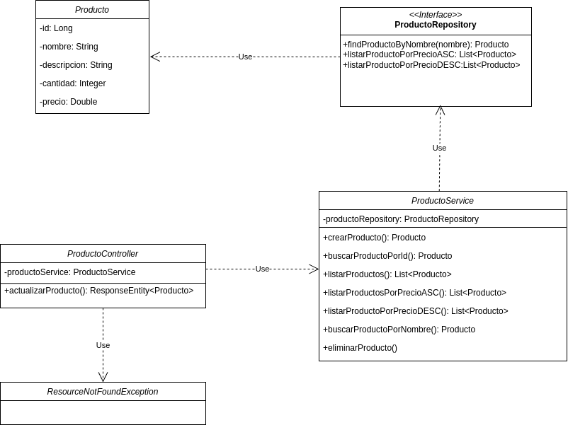

Este proyecto es una aplicación desarrollada en **Java** con **Spring Boot** y **JPA**, en una base de datos local **H2**. A continuación, se incluyen las instrucciones para ejecutar la aplicación y una representación del diagrama de clases.

## ▶️ Pasos para ejecutar la aplicación

1. **Clona el repositorio**:
   En el directorio donde deseas clonar el repositorio, abre la terminal de **git bash** e ingresa
   
   git clone https://github.com/GuilleArditti/Ejercicio-Paygoal.git

2. **Entra en el directorio del proyecto**:
   
     cd Ejercicio-paygoal

3. **Compila y ejecuta la aplicacion con Maven** 

   mvn spring-boot:run
       
    (Tambien puedes ingresar desde tu editor de código preferido al directorio del proyecto y ejecutar la aplicación)

4. **Acceder a la aplicacion desde el navegador**:

    http://localhost:8080/paygoal/productos

## 📌 Diagrama de Clases

A continuación se muestra el diagrama de clases del proyecto:

